<!-- ═══════════════════════════════════════════════════════════════ -->
<!--                    NEERAJ • FULL STACK • AI                       -->
<!--          Dynamic README • github.com/ydv129                      -->
<!-- ═══════════════════════════════════════════════════════════════ -->

<div align="center">


</div>

<!-- ─────────────────── ANIMATED TAGLINE ─────────────────── -->

<div align="center">
  <a href="https://github.com/ydv129">
    
  </a>
</div>

<br/>

<!-- ─────────────────── STATUS STRIP ─────────────────── -->

<div align="center">

[](https://github.com/ydv129)
[](https://github.com/ydv129)
[](https://github.com/ydv129)
[](https://github.com/ydv129)

</div>

<br/>

<!-- ─────────────────── BIO + STATS ─────────────────── -->

<table>
<tr>
<td width="55%" valign="top">

### 🎯 Engineering Philosophy

```yaml
approach:     "Architecture over decoration"
principle:    "Solve complexity, don't create it"
focus:        "Measurable impact > buzzwords"
stack_depth:  "Full-stack web development"
exploring:    "AI Integration + scalable systems"
```

**Core Competencies**

- 🌐 **Full-Stack Development** — End-to-end web solutions with modern frameworks
- ⚡ **Performance Engineering** — Optimized UI, efficient API pipelines
- 🤖 **AI Integration** — Production-grade LLM workflows
- 🔒 **Type Safety** — TypeScript-first engineering discipline
- 🛡️ **Security Mindset** — Secure coding practices

</td>
<td width="45%" valign="top" align="center">


<br/>

**📊 Quick Stats**


📧 **YDV129111@GMAIL.COM**

</td>
</tr>
</table>

---

<!-- ─────────────────── CURRENT FOCUS ─────────────────── -->

<div align="center">

## 🎯 Current Engineering Focus

<table>
<tr>
<td align="center" width="25%">

### 🎨 Frontend

Modern UI/UX<br/>
Responsive design<br/>
Component libraries<br/>
State management

</td>
<td align="center" width="25%">

### ⚡ Backend

REST APIs<br/>
Database design<br/>
Authentication<br/>
Server optimization

</td>
<td align="center" width="25%">

### 🛡️ Security

Secure coding<br/>
Data protection<br/>
API security<br/>
Best practices

</td>
<td align="center" width="25%">

### 🧠 AI/ML

LLM integration<br/>
Prompt engineering<br/>
AI workflows<br/>
Automation

</td>
</tr>
</table>

**Continuous Learning Path**

```mermaid
graph LR
    A[Web Basics] --> B[Frontend] --> C[Full Stack] --> D[System Design] --> E[AI Integration] --> F[Production]
    classDef step1 fill:#1F6FEB,color:#fff,stroke:#0969DA,stroke-width:2px
    classDef step2 fill:#58A6FF,color:#000,stroke:#1F6FEB,stroke-width:2px
    classDef step3 fill:#79C0FF,color:#000,stroke:#58A6FF,stroke-width:2px
    classDef step4 fill:#FF7B72,color:#fff,stroke:#DA3633,stroke-width:2px
    classDef step5 fill:#A5D6FF,color:#000,stroke:#79C0FF,stroke-width:2px
    classDef step6 fill:#3FB950,color:#fff,stroke:#238636,stroke-width:2px
    class A step1
    class B step2
    class C step3
    class D step4
    class E step5
    class F step6
```



</div>

---

<!-- ─────────────────── TECH STACK ─────────────────── -->

<div align="center">

## ⚙️ Technology Stack

<table>
<tr>
<td align="center" width="25%">

**🌐 Frontend**


React • TypeScript<br/>
HTML • CSS • Tailwind

</td>
<td align="center" width="25%">

**⚡ Backend**


Node.js • Express<br/>
Socket.io • REST APIs

</td>
<td align="center" width="25%">

**🗄️ Database**


MongoDB • Redis<br/>
MySQL • Postgres

</td>
<td align="center" width="25%">

**🛠️ DevOps**


Docker • Linux<br/>
Nginx • Git

</td>
</tr>
</table>

### 📱 Mobile Development

<table>
<tr>
<td align="center" width="100%">


React Native • Expo<br/>
TypeScript • Reanimated

</td>
</tr>
</table>

<details>
<summary><b>🔧 Full Technology Arsenal</b></summary>
<br/>


</details>

</div>

---

<!-- ─────────────────── WEB PROJECTS ─────────────────── -->

<div align="center">

## 🌐 Web Projects

<table align="center">
<tr>
<td width="50%" valign="top" align="center">

### 💎 [SheetFlow](https://github.com/ydv129/SheetFlow)

> A local-first, zero-cloud Excel dashboarding and AI analysis tool built for MSMEs.

**Highlights**
- 📊 **Excel Dashboarding** — AI-powered data analysis
- 🧠 **AI Integration** — Smart insights and automation
- 💾 **Local-First** — Zero cloud dependency

`React` `TypeScript` `Node.js` `MongoDB`

<br/>

<a href="https://github.com/ydv129/SheetFlow">
  
</a>

</td>
<td width="50%" valign="top" align="center">

### 🛡️ [Mobicure](https://github.com/ydv129/Mobicure)

> Cybersecurity and digital forensic intelligence platform.

**Features**
- 🔐 **Security Analysis** — Threat detection
- 🖼️ **Image Forensics** — Tampering detection
- 🌐 **Network Intel** — Live diagnostics

`React Native` `TypeScript` `Node.js`

🔗 **Live:** [ty-project-final.onrender.com](https://ty-project-final.onrender.com/)

<br/>

<a href="https://github.com/ydv129/Mobicure">
  
</a>

</td>
</tr>
</table>

</div>

<div align="center">

<a href="https://github.com/ydv129?tab=repositories">
  
</a>

</div>

---

<!-- ─────────────────── REACT NATIVE APPS ─────────────────── -->

<div align="center">

## 📱 React Native Apps

<table align="center">
<tr>
<td width="100%" valign="top" align="center">

### 🏥 [VellaMinds](https://github.com/ydv129/VellaMinds)

> Medi Apps - Healthcare/Medical application.

**Features**
- 🏥 **Healthcare Platform** — Medical services
- 📱 **Mobile-First** — Built with React Native
- 🔒 **Secure** — Data protection

`React Native` `TypeScript` `Expo`

<br/>

<a href="https://github.com/ydv129/VellaMinds">
  
</a>

</td>
</tr>
</table>

</div>

---

<!-- ─────────────────── GITHUB ANALYTICS ─────────────────── -->

<div align="center">

## 📊 GitHub Analytics

<table>
<tr>
<td width="50%">

</td>
<td width="50%">

</td>
</tr>
<tr>
<td width="50%">

</td>
<td width="50%">

</td>
</tr>
</table>

</div>

---

<!-- ─────────────────── CONTACT ─────────────────── -->

<div align="center">

## 💬 Let's Build Something Exceptional


<br/>

### Connect on Your Platform of Choice

<a href="mailto:YDV129111@GMAIL.COM">
  
</a>
&nbsp;
<a href="https://github.com/ydv129">
  
</a>
&nbsp;
<a href="https://github.com/ydv129">
  
</a>
&nbsp;
<a href="https://github.com/ydv129?tab=repositories">
  
</a>

<br/>

### 📋 Currently Available For

<table>
<tr>
<td align="center" width="33%">
<b>💼 Full-Time Roles</b><br/>
Full Stack + AI positions<br/>
focused on modern systems
</td>
<td align="center" width="34%">
<b>🤝 Contract Work</b><br/>
High-impact freelance projects<br/>
with real technical challenges
</td>
<td align="center" width="33%">
<b>🌍 Collaboration</b><br/>
Open-source contributions<br/>
& technical partnerships
</td>
</tr>
</table>

<a href="mailto:YDV129111@GMAIL.COM">
  
</a>

</div>

---

<!-- ─────────────────── CONTRIBUTION SNAKE ─────────────────── -->

<div align="center">

### 🐍 Contribution Activity

<picture>
  <source media="(prefers-color-scheme: dark)" srcset="https://raw.githubusercontent.com/ydv129/ydv129/output/github-snake-dark.svg"/>
  <source media="(prefers-color-scheme: light)" srcset="https://raw.githubusercontent.com/ydv129/ydv129/output/github-snake.svg"/>
  
</picture>

</div>

---

<!-- ─────────────────── FOOTER ─────────────────── -->

<div align="center">

## ⚡ Build • Scale • Evolve

> *"Beautiful products feel effortless — behind that simplicity is relentless engineering."* — *Neeraj*

<div align="center">

```txt
Build what matters.
Scale what works.
Optimize relentlessly.
Ship with intent.
```

</div>

<div align="center">

<sub>⭐ <i>If you find my work interesting, consider starring a repo or dropping a hello.</i></sub>

<br/>

<sub>🛠️ Crafted with intent • Engineered for impact</sub>

</div>

</div>

<br/>

<div align="center">


</div>
