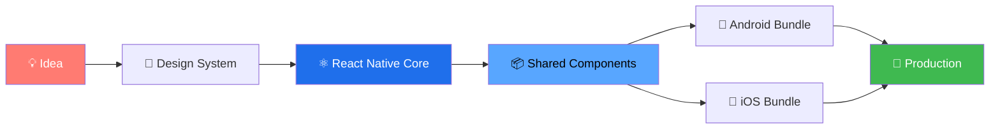

<!-- ═══════════════════════════════════════════════════════════════ -->
<!--                    NEERAJ • PRODUCT ENGINEER                     -->
<!--          Dynamic README • github.com/ydv129                      -->
<!-- ═══════════════════════════════════════════════════════════════ -->

<div align="center">


</div>

<!-- ─────────────────── ANIMATED TAGLINE ─────────────────── -->

<div align="center">
  <a href="https://github.com/ydv129">
    
  </a>
</div>

<br/>

<!-- ─────────────────── STATUS STRIP ─────────────────── -->

<div align="center">


</div>

<br/>

<!-- ─────────────────── BIO + STATS ─────────────────── -->

<table>
<tr>
<td width="55%" valign="top">

### 🎯 Engineering Philosophy

```yaml
approach:     "Architecture over decoration"
principle:    "Solve complexity, don't create it"
focus:        "Measurable impact > buzzwords"
stack_depth:  "Full-stack with mobile bias"
exploring:    "React Native + AI + scalable systems"
```

**Core Competencies**

- 📱 **Cross-Platform Mobile** — One React Native codebase, native-feel everywhere
- ⚡ **Performance Engineering** — 60fps UI, optimized API pipelines
- 🤖 **AI Integration** — Production-grade LLM workflows
- 🔒 **Type Safety** — TypeScript-first engineering discipline
- 🛡️ **Security Mindset** — Forensic-grade architectural thinking

</td>
<td width="45%" valign="top" align="center">


<br/>

**📊 Quick Stats**


📧 **YDV129111@GMAIL.COM**

</td>
</tr>
</table>

---

<!-- ─────────────────── TECH STACK ─────────────────── -->

<div align="center">

## ⚙️ Technology Stack

<table>
<tr>
<td align="center" width="25%">

**📱 Mobile**


React Native • Expo<br/>
TypeScript • Reanimated

</td>
<td align="center" width="25%">

**⚡ Backend**


Node.js • Express<br/>
Socket.io • REST APIs

</td>
<td align="center" width="25%">

**🗄️ Database**


MongoDB • Redis<br/>
MySQL • Postgres

</td>
<td align="center" width="25%">

**🛠️ DevOps**


Docker • Linux<br/>
Nginx • Git

</td>
</tr>
</table>

<details>
<summary><b>🔧 Full Technology Arsenal</b></summary>
<br/>


</details>

</div>

---

<!-- ─────────────────── FEATURED PROJECTS ─────────────────── -->

<div align="center">

## 🏗️ Featured Engineering Work

</div>

<table>
<tr>
<td width="50%" valign="top">

### 🛡️ [Mobicure](https://github.com/ydv129/Mobicure)

> **Advanced cybersecurity + digital forensic intelligence platform** — multi-domain threat analysis combining application security, phishing detection, image forensics, and live network intelligence in one unified dashboard.

**Core Capabilities**
- 🦠 **Malware & APK Analysis** — Behavioral inspection, permission audits, package risk profiling
- 🎣 **Phishing & Threat Intel** — Email, URL, and domain risk scanning
- 🖼️ **Image Forensics** — Tampering, morphing & metadata anomaly detection
- 🌐 **Network Intelligence** — Exposure scans, live diagnostics, geo-aware analytics
- ⚙️ **Modular Engine Architecture** — Pluggable analyzers, Python bridge service

**Architecture** — Independent analyzer modules (APK • Email • URL • Image • Network • Health • Python Bridge) for scalable detection without core changes.

`React Native` `TypeScript` `Node.js` `Python` `Security`

🔗 **Live:** [ty-project-final.onrender.com](https://ty-project-final.onrender.com/)

<a href="https://github.com/ydv129/Mobicure">
  
</a>

</td>
<td width="50%" valign="top">

### 💎 [Sheetflow](https://github.com/ydv129/Sheetflow)

> Workflow & data orchestration tool designed for speed — fluid UI, structured logic, and scalable backend integration for high-volume data pipelines.

**Highlights**
- ⚡ **Real-time data flow** — Live sync with reactive state propagation
- 🧩 **Modular UI components** — Composable, reusable, theme-aware
- 🚀 **Performance-conscious** — Virtualization, memoization, batched updates
- 🔌 **Built for extensibility** — Plugin-friendly orchestration core

**Use Case** — Bridges spreadsheet-style data with structured backend workflows for teams that need both flexibility and rigor.

`React` `TypeScript` `Node.js` `MongoDB`

<br/>

<a href="https://github.com/ydv129/Sheetflow">
  
</a>

</td>
</tr>
</table>

<div align="center">

<a href="https://github.com/ydv129?tab=repositories">
  
</a>

</div>

---

<!-- ─────────────────── APP DEVELOPMENT JOURNEY (CONSOLIDATED) ─────────────────── -->

<div align="center">

## 📱 App Development Journey

> **One codebase. Every platform. Native experience.**  
> My mobile work is built entirely on **React Native** — a single, type-safe foundation that ships to both **Android** and **iOS** without sacrificing performance or platform feel.

<br/>


### ⚛️ React Native — Cross-Platform Core

</div>

<table>
<tr>
<td width="33%" align="center" valign="top">

#### 🎨 Unified UI Layer

Reusable component system<br/>
Theme-aware design tokens<br/>
Adaptive layouts<br/>
Gesture & animation engine

</td>
<td width="34%" align="center" valign="top">

#### ⚡ Native Performance

60fps animations (Reanimated)<br/>
Hermes engine optimization<br/>
Bridgeless architecture<br/>
Memory-efficient rendering

</td>
<td width="33%" align="center" valign="top">

#### 🔧 Production Pipeline

TypeScript strict mode<br/>
EAS build & deploy<br/>
OTA updates<br/>
Crash analytics & telemetry

</td>
</tr>
</table>

<div align="center">

**Build & Delivery Workflow**



<sub><i>Single codebase → dual-platform delivery → continuous deployment</i></sub>

</div>

---

<!-- ─────────────────── GITHUB ANALYTICS ─────────────────── -->

<div align="center">

## 📊 GitHub Analytics

<a href="https://github.com/ryo-ma/github-profile-trophy">
  
</a>

<table>
<tr>
<td width="50%">

</td>
<td width="50%">

</td>
</tr>
<tr>
<td width="50%">

</td>
<td width="50%">

</td>
</tr>
</table>

</div>

---

<!-- ─────────────────── CURRENT FOCUS ─────────────────── -->

<div align="center">

## 🎯 Current Engineering Focus

<table>
<tr>
<td align="center" width="25%">

### 🎨 Product UX

Micro-interactions<br/>
Fluid animations<br/>
Native-feel design<br/>
Accessibility-first

</td>
<td align="center" width="25%">

### ⚡ Performance

Smooth 60fps UI<br/>
Optimized renders<br/>
Fast API pipelines<br/>
Memory-efficient logic

</td>
<td align="center" width="25%">

### 🛡️ Security

Threat detection<br/>
Forensic analysis<br/>
Secure data flow<br/>
Auth hardening

</td>
<td align="center" width="25%">

### 🧠 Intelligence

Realtime sync<br/>
Offline-first<br/>
AI / LLM workflows<br/>
Automation layers

</td>
</tr>
</table>

**Continuous Learning Path**


</div>

---

<!-- ─────────────────── CONTACT ─────────────────── -->

<div align="center">

## 💬 Let's Build Something Exceptional


<br/><br/>

### Connect on Your Platform of Choice

<a href="mailto:YDV129111@GMAIL.COM">
  
</a>
&nbsp;
<a href="https://github.com/ydv129">
  
</a>
&nbsp;
<a href="https://linkedin.com">
  
</a>
&nbsp;
<a href="https://ty-project-final.onrender.com/">
  
</a>

<br/><br/>

### 📋 Currently Available For

<table>
<tr>
<td align="center" width="33%">
<b>💼 Full-Time Roles</b><br/>
Product Engineer positions<br/>
focused on scalable mobile systems
</td>
<td align="center" width="34%">
<b>🤝 Contract Work</b><br/>
High-impact freelance projects<br/>
with real technical challenges
</td>
<td align="center" width="33%">
<b>🌍 Collaboration</b><br/>
Open-source contributions<br/>
& technical partnerships
</td>
</tr>
</table>

<br/>

<a href="mailto:YDV129111@GMAIL.COM">
  
</a>

</div>

---

<!-- ─────────────────── CONTRIBUTION SNAKE ─────────────────── -->

<div align="center">

### 🐍 Contribution Activity

<picture>
  <source media="(prefers-color-scheme: dark)" srcset="https://raw.githubusercontent.com/ydv129/ydv129/output/github-snake-dark.svg"/>
  <source media="(prefers-color-scheme: light)" srcset="https://raw.githubusercontent.com/ydv129/ydv129/output/github-snake.svg"/>
  
</picture>

<sub><i>Requires the <a href="https://github.com/Platane/snk">Snake action</a> workflow in your <code>ydv129/ydv129</code> repo to generate these SVGs automatically.</i></sub>

</div>

---

<!-- ─────────────────── QUOTE ─────────────────── -->

<div align="center">


</div>

---

<!-- ─────────────────── FOOTER ─────────────────── -->

<div align="center">

## ⚡ Build • Scale • Evolve

### 💭 Engineering Manifesto

> **"Beautiful products feel effortless — behind that simplicity is relentless engineering."**  
> — *Neeraj*

```txt
Build what matters.
Scale what works.
Optimize relentlessly.
Ship with intent.
```

<br/>


<br/>

<sub>⭐ <i>If you find my work interesting, consider starring a repo or dropping a hello.</i></sub>

<br/><br/>

<sub>🛠️ <i>Crafted with intent • Engineered for impact</i></sub>

</div>

